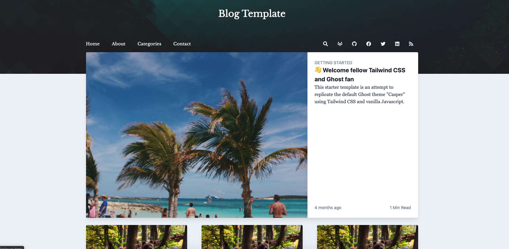
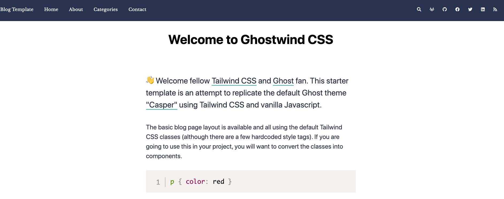
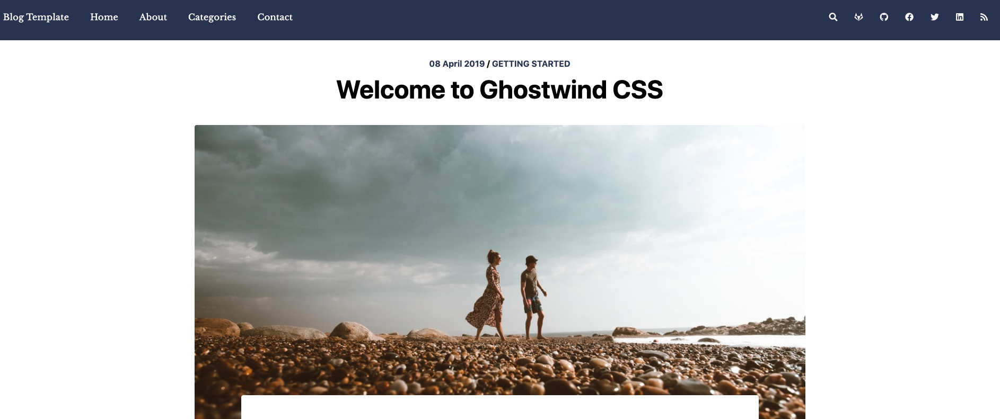
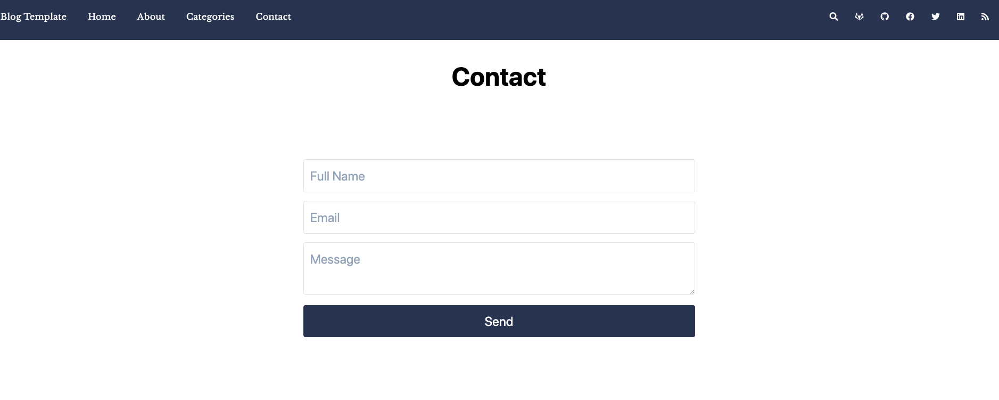

# [Blog Template](https://github.com/Kodrika/blog-template)

This template is a modified version of the [Ghostwind Template](https://www.tailwindtoolbox.com/templates/ghostwind) created by [Tailwind Toolbox](https://www.tailwindtoolbox.com/).

#### Homepage

#### About

#### Post

#### Contact

## Getting Started

Choose one of the following options to get started:
* [Download the latest release](#)
* Clone the repo: `git clone https://github.com/Kodrika/blog-template.git`
* Fork the repo

## Customizing the Template
Take a look at Tailwind Toolbox's [setup guide](https://www.tailwindtoolbox.com/setup) to start tweaking!

## Credits
- [Starter Template](https://github.com/tailwindtoolbox/Ghostwind)
- [Favicon](https://www.iconfinder.com/icons/3069182/business_computer_device_office_technology_icon)
- [Header Background](https://graphicburger.com/seamless-polygon-backgrounds-vol2/)
- [Contact Form](https://tailwindcomponents.com/component/sign-up-form)